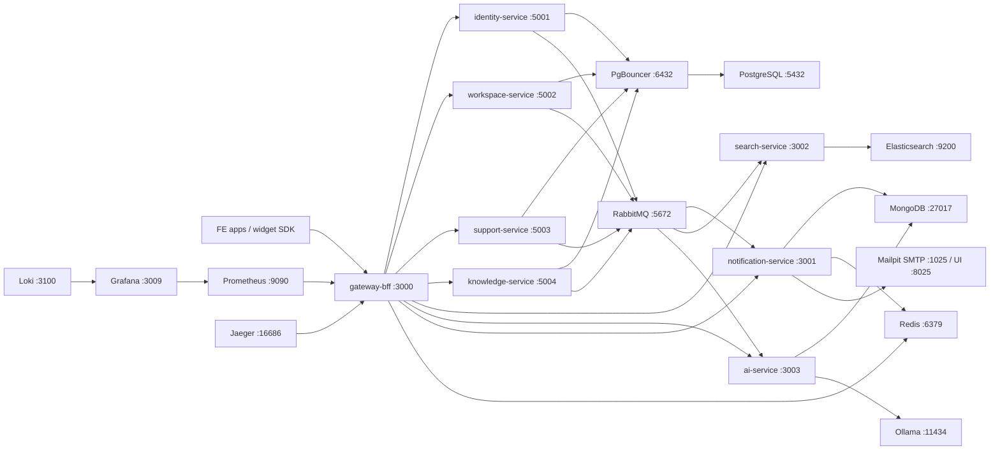

# Local Runtime Rules

This file locks the Day 1 local runtime conventions for backend services and infrastructure.

## Docker

- Compose file: `infra/docker/docker-compose.local.yml`
- Observability Compose file: `infra/docker/docker-compose.observability.yml`
- Docker project name: `signaldesk-local`
- Docker network: `signaldesk-local`
- Container DNS names must use the Compose service name, for example `postgres`, `pgbouncer`, `redis`, `rabbitmq`, `mongodb`, `elasticsearch`, `mailpit`, and `ollama`.
- Services running inside Docker should not call infrastructure by `localhost`; they should use the DNS names above.
- Services running directly on the host can use the published localhost ports from `.env.example`.

## Port Rules

| Component | Host Port |
| --- | ---: |
| gateway-bff | 3000 |
| notification-service | 3001 |
| search-service | 3002 |
| ai-service | 3003 |
| identity-service | 5001 |
| workspace-service | 5002 |
| support-service | 5003 |
| knowledge-service | 5004 |
| campaign-service | 5005 |
| PostgreSQL | 5432 |
| PgBouncer | 6432 |
| MongoDB | 27017 |
| Redis | 6379 |
| RabbitMQ AMQP | 5672 |
| RabbitMQ management | 15672 |
| Elasticsearch | 9200 |
| Mailpit SMTP | 1025 |
| Mailpit UI | 8025 |
| Ollama | 11434 |
| Prometheus | 9090 |
| Grafana | 3009 |
| Jaeger UI | 16686 |
| OpenTelemetry OTLP gRPC | 4317 |
| OpenTelemetry OTLP HTTP | 4318 |
| Loki | 3100 |

## Local Runtime Diagram



## Local UI URLs

| Tool | URL |
| --- | --- |
| Gateway | `http://localhost:3000` |
| RabbitMQ management | `http://localhost:15672` (`signaldesk` / `signaldesk`) |
| Mailpit UI | `http://localhost:8025` |
| Elasticsearch | `http://localhost:9200` |
| Ollama tags | `http://localhost:11434/api/tags` |
| Prometheus | `http://localhost:9090` |
| Grafana | `http://localhost:3009` (`admin` / `admin`) |
| Jaeger | `http://localhost:16686` |
| Loki ready | `http://localhost:3100/ready` |

## Environment Naming

- Service ports use `<SERVICE_NAME>_PORT`, for example `IDENTITY_SERVICE_PORT`.
- Infrastructure URLs use stable names: `MONGODB_URI`, `REDIS_URL`, `RABBITMQ_URL`, and `ELASTICSEARCH_URL`.
- Object storage uses Supabase Storage by default: `STORAGE_PROVIDER=supabase`, `SUPABASE_URL`, `SUPABASE_ANON_KEY`, `SUPABASE_SERVICE_ROLE_KEY`, and bucket variables.
- PostgreSQL settings use `POSTGRES_HOST`, `POSTGRES_PORT`, `POSTGRES_DB`, `POSTGRES_USER`, and `POSTGRES_PASSWORD`.
- PgBouncer settings use `PGBOUNCER_HOST` and `PGBOUNCER_PORT`.
- JWT key paths use `JWT_PUBLIC_KEY_PATH` and `JWT_PRIVATE_KEY_PATH`.
- Gateway readiness checks Redis and downstream URL configuration by default.
  Set `GATEWAY_READY_CHECK_DOWNSTREAMS=true` when downstream services are running
  and the gateway should call each `/health/ready` endpoint.

## PostgreSQL Bootstrap And Migration Rule

- Files under `infra/postgres/init` are bootstrap SQL for a fresh local PostgreSQL
  volume only. Docker runs them through `/docker-entrypoint-initdb.d` when
  `postgres-data` is empty; it does not rerun them on an existing volume.
- Day 2 keeps only shared baseline objects there: schemas, `ops.outbox_events`,
  `ops.inbox_messages`, `ops.idempotency_keys`, `ops.audit_logs`, and
  `ops.dead_letters`.
- `ops.inbox_messages` includes retention and cleanup support through `expires_at`,
  `ix_inbox_processing_stale`, `ix_inbox_retention`, and `ix_inbox_processed_lookup`.
- From Day 4 onward, service-owned tables should be created through each
  service's migration path, not by editing bootstrap SQL after local data exists.
- If a bootstrap SQL change must be reapplied locally, reset the local PostgreSQL
  volume intentionally:

```powershell
docker compose -f infra/docker/docker-compose.local.yml down -v
docker compose -f infra/docker/docker-compose.local.yml up -d
```

This deletes local infrastructure data. Use it only for disposable local
baselines, then rerun the Day 2 smoke test.

## File Upload Handoff For FE

- FE never uploads binary content through the main backend API.
- FE calls the backend to request a signed upload URL for the target tenant and file metadata.
- Backend validates tenant, permission, content type, size, and storage bucket policy.
- Backend returns a short-lived Supabase Storage signed upload URL.
- FE uploads the binary directly to Supabase Storage.
- FE calls the backend to finalize metadata with the returned object key.
- Backend stores only metadata and object key in PostgreSQL; the binary source of truth is Supabase Storage.
- Signed upload/download TTL defaults to `900` seconds through
  `SUPABASE_STORAGE_UPLOAD_URL_TTL_SECONDS` and `SUPABASE_STORAGE_SIGNED_URL_TTL_SECONDS`.

## RabbitMQ Retry And DLQ Rule

- Main workload queues dead-letter transient failures to `signaldesk.domain-events.dlx`
  with routing keys such as `notification.events.retry`.
- Retry queues delay messages by TTL, then route them back to `signaldesk.domain-events`
  using replay routing keys such as `notification.events.replay`.
- Consumers own the final retry decision:
  - Read retry count from message headers, preferring `x-signaldesk-retry-count`.
  - If retry count is below `RABBITMQ_MAX_RETRY_COUNT`, republish to the retry routing key
    and increment `x-signaldesk-retry-count`.
  - If retry count reaches `RABBITMQ_MAX_RETRY_COUNT`, publish to the matching DLQ
    routing key such as `notification.events.dlq`.
  - For .NET services with PostgreSQL, also persist the failed message into `ops.dead_letters`.
- Manual replay must be idempotent because consumers use inbox deduplication.

## Local Log Collection

- Promtail scrapes Docker json logs for containers named `signaldesk-*`.
- Promtail also keeps a local file scrape fallback at `infra/monitoring/promtail/logs/*.log`.
- Loki queries should use labels such as `container`, `compose_project`, and
  `compose_service` once the observability stack is running.

## Local Commands

Validate the Compose file:

```powershell
docker compose -f infra/docker/docker-compose.local.yml config
```

Start local infrastructure:

```powershell
docker compose -f infra/docker/docker-compose.local.yml up -d
```

Start observability after local infrastructure has created the shared network:

```powershell
docker compose -f infra/docker/docker-compose.observability.yml up -d
```

Check local infrastructure:

```powershell
docker compose -f infra/docker/docker-compose.local.yml ps
```

Check observability:

```powershell
docker compose -f infra/docker/docker-compose.observability.yml ps
```

Run the Day 2 smoke test:

```powershell
powershell -ExecutionPolicy Bypass -File infra/scripts/smoke-local.ps1
```

Run app readiness checks after starting backend services on the host:

```powershell
powershell -ExecutionPolicy Bypass -File infra/scripts/smoke-local.ps1 -SkipUp -CheckServices
```

Stop local infrastructure:

```powershell
docker compose -f infra/docker/docker-compose.local.yml down
```

Stop observability:

```powershell
docker compose -f infra/docker/docker-compose.observability.yml down
```
